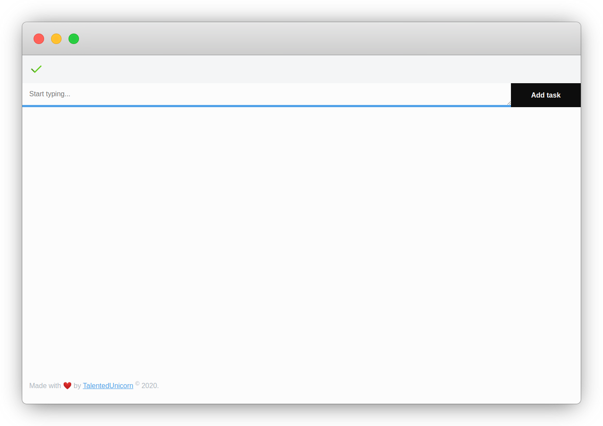

# ToDone

> Todo list app with offline storage

# Features

- [x] Offline support using [localForage](https://github.com/localForage/localForage)
  - 
  - 
  - 
  - 
- [x] Markdown support with [react-markdown](https://github.com/rexxars/react-markdown)
  - 
  - 

## Nice to have

- [ ] Categories
- [ ] Export/Import data

## Contributions

This project is free to use, code contributions are welcome - see [contributing guidelines](CONTRIBUTING.md). If you feel like buying me a coffee/beer you can [donate here](https://paypal.me/talentedunicorn).
