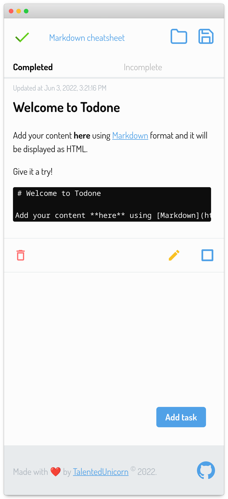

# ToDone

> Todo list app with offline storage

# Features

- [x] Offline support using [localForage](https://github.com/localForage/localForage)
- [x] Markdown support with [markdown-to-jsx](https://github.com/probablyup/markdown-to-jsx)
- [x] Export data with [FileSaver.js](https://www.npmjs.com/package/file-saver)
- [x] Import data - currently supports `.json` format

## Nice to have

- [ ] Categories
- [ ] WYSIWYG mode

## Contributions

This project is free to use, code contributions are welcome - see [contributing guidelines](CONTRIBUTING.md). If you feel like buying me a coffee/beer you can [donate here](https://paypal.me/talentedunicorn).
